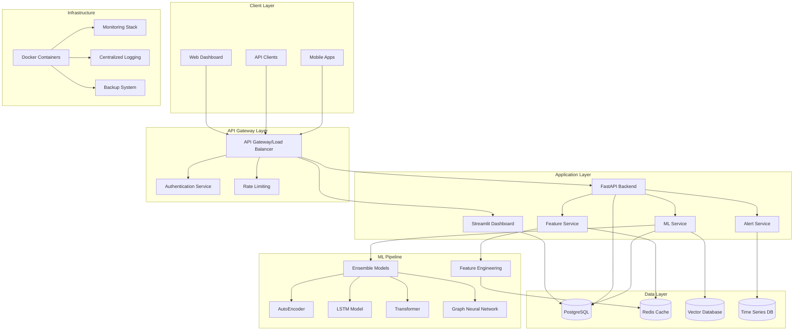

# Enterprise Fraud Detection System - Design Document

## Overview

Bu design document, mevcut fraud detection sistemini enterprise-grade seviyesine çıkarmak için gerekli mimari ve teknik tasarımı detaylandırır. Sistem, yüksek performanslı ML pipeline'ları, real-time processing, advanced analytics ve enterprise security özelliklerini içerecektir.

## Architecture

### High-Level Architecture



### Microservices Architecture

1. **API Gateway Service**: Request routing, authentication, rate limiting
2. **ML Service**: Model inference, ensemble predictions, model management
3. **Feature Service**: Real-time feature engineering and caching
4. **Alert Service**: Real-time alerting and notification system
5. **Analytics Service**: Advanced analytics and reporting
6. **Data Pipeline Service**: ETL processes and data validation

## Components and Interfaces

### 1. Advanced ML Pipeline

#### Ensemble Model Manager
```python
class EnsembleModelManager:
    def __init__(self):
        self.models = {
            'autoencoder': AutoEncoderModel(),
            'lstm': LSTMFraudDetector(),
            'transformer': TransformerFraudDetector(),
            'gnn': GraphNeuralNetwork(),
            'xgboost': XGBoostModel(),
            'random_forest': RandomForestModel()
        }
        self.weights = self.load_model_weights()
        self.performance_tracker = ModelPerformanceTracker()
    
    def predict_ensemble(self, features: np.ndarray) -> Dict:
        predictions = {}
        for name, model in self.models.items():
            pred = model.predict(features)
            predictions[name] = pred
        
        ensemble_pred = self.weighted_ensemble(predictions)
        return {
            'fraud_probability': ensemble_pred,
            'individual_predictions': predictions,
            'model_weights': self.weights,
            'confidence': self.calculate_confidence(predictions)
        }
```

#### Model Performance Monitoring
```python
class ModelPerformanceTracker:
    def track_prediction(self, model_name: str, prediction: float, 
                        actual: Optional[bool] = None):
        # Track prediction metrics
        # Monitor model drift
        # Alert on performance degradation
        pass
    
    def calculate_metrics(self, model_name: str, time_window: str) -> Dict:
        # Calculate precision, recall, F1, AUC
        # Return comprehensive metrics
        pass
```

### 2. Real-time Feature Engineering

#### Feature Store Architecture
```python
class FeatureStore:
    def __init__(self):
        self.redis_client = redis.Redis()
        self.postgres_client = PostgreSQLClient()
        self.feature_cache = FeatureCache()
    
    def get_features(self, transaction_id: str, user_id: str, 
                    merchant_id: str) -> Dict:
        # Check cache first
        cached_features = self.feature_cache.get(transaction_id)
        if cached_features:
            return cached_features
        
        # Calculate real-time features
        features = self.calculate_realtime_features(
            user_id, merchant_id, transaction_id
        )
        
        # Cache for future use
        self.feature_cache.set(transaction_id, features, ttl=3600)
        return features
    
    def calculate_realtime_features(self, user_id: str, 
                                  merchant_id: str, 
                                  transaction_id: str) -> Dict:
        # Temporal features
        temporal_features = self.get_temporal_features()
        
        # Velocity features
        velocity_features = self.get_velocity_features(user_id)
        
        # Behavioral features
        behavioral_features = self.get_behavioral_features(user_id)
        
        # Network features
        network_features = self.get_network_features(user_id, merchant_id)
        
        return {
            **temporal_features,
            **velocity_features,
            **behavioral_features,
            **network_features
        }
```

### 3. Advanced Analytics Engine

#### Analytics Service
```python
class AdvancedAnalyticsEngine:
    def __init__(self):
        self.data_connector = DataConnector()
        self.visualization_engine = VisualizationEngine()
        self.report_generator = ReportGenerator()
    
    def generate_fraud_insights(self, time_range: str) -> Dict:
        # Temporal analysis
        temporal_insights = self.analyze_temporal_patterns(time_range)
        
        # Geographic analysis
        geo_insights = self.analyze_geographic_patterns(time_range)
        
        # Behavioral analysis
        behavioral_insights = self.analyze_behavioral_patterns(time_range)
        
        # Financial analysis
        financial_insights = self.analyze_financial_patterns(time_range)
        
        return {
            'temporal': temporal_insights,
            'geographic': geo_insights,
            'behavioral': behavioral_insights,
            'financial': financial_insights,
            'summary': self.generate_summary(
                temporal_insights, geo_insights, 
                behavioral_insights, financial_insights
            )
        }
```

### 4. High-Performance Data Layer

#### Database Optimization
```sql
-- Partitioning strategy for large tables
CREATE TABLE transactions_y2024m01 PARTITION OF transactions
FOR VALUES FROM ('2024-01-01') TO ('2024-02-01');

-- Specialized indexes for ML queries
CREATE INDEX CONCURRENTLY idx_transactions_ml_features 
ON transactions (user_id, merchant_id, transaction_timestamp, amount, fraud_score)
WHERE transaction_timestamp > NOW() - INTERVAL '90 days';

-- Materialized views for analytics
CREATE MATERIALIZED VIEW mv_fraud_summary_daily AS
SELECT 
    DATE(transaction_timestamp) as date,
    COUNT(*) as total_transactions,
    COUNT(*) FILTER (WHERE is_fraud = true) as fraud_count,
    AVG(fraud_score) as avg_fraud_score,
    SUM(amount) as total_amount
FROM transactions
GROUP BY DATE(transaction_timestamp);
```

#### Redis Caching Strategy
```python
class CacheManager:
    def __init__(self):
        self.redis_client = redis.Redis()
        self.cache_strategies = {
            'user_features': {'ttl': 300, 'key_pattern': 'user_features:{user_id}'},
            'merchant_stats': {'ttl': 600, 'key_pattern': 'merchant_stats:{merchant_id}'},
            'model_predictions': {'ttl': 3600, 'key_pattern': 'pred:{transaction_id}'}
        }
    
    def get_cached_features(self, cache_type: str, identifier: str) -> Optional[Dict]:
        strategy = self.cache_strategies[cache_type]
        key = strategy['key_pattern'].format(**{cache_type.split('_')[0] + '_id': identifier})
        cached_data = self.redis_client.get(key)
        return json.loads(cached_data) if cached_data else None
```

## Data Models

### Enhanced Transaction Model
```python
@dataclass
class EnhancedTransaction:
    # Basic transaction info
    transaction_id: str
    user_id: str
    merchant_id: str
    amount: Decimal
    currency: str
    timestamp: datetime
    
    # Location data
    latitude: Optional[float]
    longitude: Optional[float]
    country: str
    city: Optional[str]
    
    # Device and network
    device_id: Optional[str]
    ip_address: str
    user_agent: Optional[str]
    
    # ML features (100+ features)
    temporal_features: Dict[str, float]
    velocity_features: Dict[str, float]
    behavioral_features: Dict[str, float]
    network_features: Dict[str, float]
    statistical_features: Dict[str, float]
    
    # ML results
    fraud_probability: float
    risk_level: RiskLevel
    decision: Decision
    model_predictions: Dict[str, float]
    feature_importance: Dict[str, float]
    
    # Metadata
    processing_time_ms: int
    model_version: str
    feature_version: str
```

### ML Model Metadata
```python
@dataclass
class MLModelMetadata:
    model_name: str
    model_version: str
    model_type: str
    training_date: datetime
    performance_metrics: Dict[str, float]
    feature_importance: Dict[str, float]
    hyperparameters: Dict[str, Any]
    training_data_stats: Dict[str, Any]
    deployment_status: str
    is_active: bool
```

## Error Handling

### Comprehensive Error Management
```python
class FraudDetectionError(Exception):
    """Base exception for fraud detection system"""
    pass

class ModelInferenceError(FraudDetectionError):
    """Error during model inference"""
    pass

class FeatureEngineeringError(FraudDetectionError):
    """Error during feature calculation"""
    pass

class DataValidationError(FraudDetectionError):
    """Error in data validation"""
    pass

class ErrorHandler:
    def __init__(self):
        self.logger = logging.getLogger(__name__)
        self.alert_service = AlertService()
    
    def handle_model_error(self, error: ModelInferenceError, 
                          transaction_id: str) -> Dict:
        # Log error
        self.logger.error(f"Model inference failed for {transaction_id}: {error}")
        
        # Send alert
        self.alert_service.send_alert(
            severity="HIGH",
            message=f"Model inference failed: {error}",
            transaction_id=transaction_id
        )
        
        # Return fallback prediction
        return {
            'fraud_probability': 0.5,  # Conservative fallback
            'risk_level': 'MEDIUM',
            'decision': 'REVIEW',
            'error': str(error),
            'fallback_used': True
        }
```

## Testing Strategy

### 1. Unit Testing
- Model prediction accuracy tests
- Feature engineering validation tests
- API endpoint functionality tests
- Database operation tests

### 2. Integration Testing
- End-to-end transaction processing tests
- ML pipeline integration tests
- Database and cache integration tests
- External API integration tests

### 3. Performance Testing
- Load testing for 10,000+ TPS
- Stress testing for peak loads
- Memory and CPU usage optimization tests
- Database query performance tests

### 4. ML Model Testing
```python
class MLModelTester:
    def test_model_accuracy(self, model, test_data):
        predictions = model.predict(test_data.features)
        accuracy = accuracy_score(test_data.labels, predictions)
        assert accuracy > 0.95, f"Model accuracy {accuracy} below threshold"
    
    def test_model_bias(self, model, test_data):
        # Test for demographic bias
        # Test for geographic bias
        # Test for temporal bias
        pass
    
    def test_model_drift(self, model, current_data, historical_data):
        # Detect feature drift
        # Detect prediction drift
        # Alert if drift exceeds threshold
        pass
```

### 5. Security Testing
- Authentication and authorization tests
- Data encryption validation
- SQL injection prevention tests
- API security tests

## Deployment Architecture

### Docker Containerization
```dockerfile
# ML Service Container
FROM python:3.11-slim

WORKDIR /app

# Install ML dependencies
COPY requirements-ml.txt .
RUN pip install -r requirements-ml.txt

# Copy ML models and code
COPY ml_service/ .
COPY models/ ./models/

# Health check
HEALTHCHECK --interval=30s --timeout=10s --start-period=60s \
  CMD curl -f http://localhost:8000/health || exit 1

EXPOSE 8000
CMD ["uvicorn", "main:app", "--host", "0.0.0.0", "--port", "8000"]
```

### Kubernetes Deployment
```yaml
apiVersion: apps/v1
kind: Deployment
metadata:
  name: fraud-detection-ml
spec:
  replicas: 3
  selector:
    matchLabels:
      app: fraud-detection-ml
  template:
    metadata:
      labels:
        app: fraud-detection-ml
    spec:
      containers:
      - name: ml-service
        image: fraud-detection/ml-service:latest
        ports:
        - containerPort: 8000
        env:
        - name: DATABASE_URL
          valueFrom:
            secretKeyRef:
              name: db-secret
              key: url
        resources:
          requests:
            memory: "2Gi"
            cpu: "1000m"
          limits:
            memory: "4Gi"
            cpu: "2000m"
```

## Monitoring and Observability

### Metrics Collection
```python
class MetricsCollector:
    def __init__(self):
        self.prometheus_client = PrometheusClient()
        self.grafana_client = GrafanaClient()
    
    def track_prediction_metrics(self, model_name: str, 
                               prediction_time: float,
                               fraud_probability: float):
        # Track prediction latency
        self.prometheus_client.histogram(
            'fraud_prediction_duration_seconds',
            prediction_time,
            labels={'model': model_name}
        )
        
        # Track fraud score distribution
        self.prometheus_client.histogram(
            'fraud_score_distribution',
            fraud_probability,
            labels={'model': model_name}
        )
```

### Alerting System
```python
class AlertingSystem:
    def __init__(self):
        self.alert_channels = {
            'email': EmailAlertChannel(),
            'slack': SlackAlertChannel(),
            'pagerduty': PagerDutyAlertChannel()
        }
    
    def send_alert(self, severity: str, message: str, 
                  metadata: Dict = None):
        alert = Alert(
            severity=severity,
            message=message,
            timestamp=datetime.now(),
            metadata=metadata or {}
        )
        
        for channel in self.alert_channels.values():
            channel.send(alert)
```

Bu design document, enterprise-grade fraud detection sisteminin tüm bileşenlerini ve mimarisini detaylandırır. Sistem yüksek performans, ölçeklenebilirlik, güvenlik ve güvenilirlik gereksinimlerini karşılayacak şekilde tasarlanmıştır.