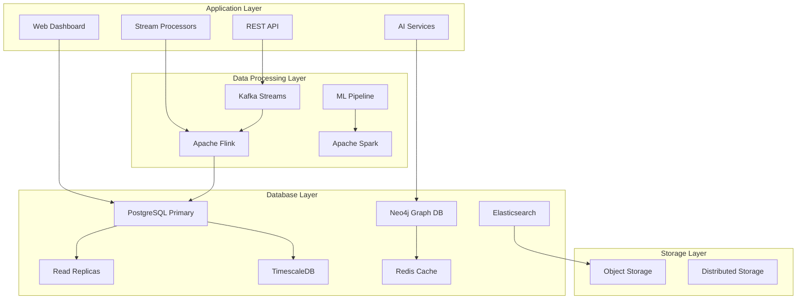

# Future Database Architecture Design

## Overview

Bu tasarım, fraud detection sisteminin gelecekteki özelliklerini desteklemek için kapsamlı bir database mimarisi sunmaktadır. Sistem, graph analytics, real-time streaming, AI-powered features ve cloud-native architecture gereksinimlerini karşılayacak şekilde tasarlanmıştır.

## Architecture

### High-Level Architecture



### Database Components

#### 1. PostgreSQL (Primary OLTP)
- **Purpose**: Core transactional data, user management, configuration
- **Features**: ACID compliance, advanced indexing, partitioning
- **Extensions**: pgvector, pg_stat_statements, pg_cron, postgis

#### 2. Neo4j (Graph Database)
- **Purpose**: Fraud ring detection, relationship analysis, network graphs
- **Features**: Graph algorithms, community detection, path finding
- **Integration**: Bi-directional sync with PostgreSQL

#### 3. TimescaleDB (Time-Series)
- **Purpose**: Metrics, monitoring data, real-time analytics
- **Features**: Automatic partitioning, compression, continuous aggregates
- **Use Cases**: System metrics, API usage, performance monitoring

#### 4. Redis (Caching & Real-time)
- **Purpose**: Feature caching, session management, real-time data
- **Features**: Pub/Sub, streams, modules (RedisGraph, RedisTimeSeries)
- **Patterns**: Cache-aside, write-through, event sourcing

#### 5. Elasticsearch (Search & Analytics)
- **Purpose**: Full-text search, log analytics, complex queries
- **Features**: Distributed search, aggregations, machine learning
- **Use Cases**: Audit logs, transaction search, anomaly detection

## Components and Interfaces

### 1. Graph Database Schema (Neo4j)

```cypher
// Node Types
CREATE CONSTRAINT ON (u:User) ASSERT u.user_id IS UNIQUE;
CREATE CONSTRAINT ON (m:Merchant) ASSERT m.merchant_id IS UNIQUE;
CREATE CONSTRAINT ON (t:Transaction) ASSERT t.transaction_id IS UNIQUE;
CREATE CONSTRAINT ON (d:Device) ASSERT d.device_id IS UNIQUE;
CREATE CONSTRAINT ON (l:Location) ASSERT l.location_id IS UNIQUE;

// Relationship Types with Properties
(:User)-[:TRANSACTED_WITH {amount: float, timestamp: datetime, fraud_score: float}]->(:Merchant)
(:User)-[:USED_DEVICE {first_used: datetime, last_used: datetime, frequency: int}]->(:Device)
(:User)-[:LOCATED_AT {timestamp: datetime, confidence: float}]->(:Location)
(:Transaction)-[:INVOLVES_USER]->(:User)
(:Transaction)-[:INVOLVES_MERCHANT]->(:Merchant)
(:Transaction)-[:USED_DEVICE]->(:Device)
(:Transaction)-[:OCCURRED_AT]->(:Location)

// Fraud Ring Detection Queries
MATCH (u1:User)-[r1:TRANSACTED_WITH]->(m:Merchant)<-[r2:TRANSACTED_WITH]-(u2:User)
WHERE r1.fraud_score > 0.7 AND r2.fraud_score > 0.7
AND abs(duration.between(r1.timestamp, r2.timestamp).seconds) < 3600
RETURN u1, u2, m, r1.fraud_score + r2.fraud_score as combined_risk
ORDER BY combined_risk DESC;
```

### 2. Time-Series Schema (TimescaleDB)

```sql
-- System metrics hypertable
CREATE TABLE system_metrics (
    time TIMESTAMPTZ NOT NULL,
    metric_name TEXT NOT NULL,
    metric_value DOUBLE PRECISION NOT NULL,
    labels JSONB,
    service_name TEXT,
    instance_id TEXT
);

SELECT create_hypertable('system_metrics', 'time', chunk_time_interval => INTERVAL '1 hour');

-- API usage tracking
CREATE TABLE api_usage_metrics (
    time TIMESTAMPTZ NOT NULL,
    endpoint TEXT NOT NULL,
    method TEXT NOT NULL,
    status_code INTEGER,
    response_time_ms INTEGER,
    request_size_bytes INTEGER,
    user_id TEXT,
    ip_address INET
);

SELECT create_hypertable('api_usage_metrics', 'time', chunk_time_interval => INTERVAL '1 day');

-- Continuous aggregates for real-time dashboards
CREATE MATERIALIZED VIEW hourly_fraud_metrics
WITH (timescaledb.continuous) AS
SELECT 
    time_bucket('1 hour', time) AS hour,
    COUNT(*) as total_requests,
    AVG(response_time_ms) as avg_response_time,
    COUNT(*) FILTER (WHERE status_code >= 400) as error_count
FROM api_usage_metrics
GROUP BY hour;
```

### 3. Enhanced PostgreSQL Schema

```sql
-- Graph relationship cache (for performance)
CREATE TABLE entity_relationships (
    id BIGSERIAL PRIMARY KEY,
    source_type VARCHAR(50) NOT NULL,
    source_id VARCHAR(100) NOT NULL,
    target_type VARCHAR(50) NOT NULL,
    target_id VARCHAR(100) NOT NULL,
    relationship_type VARCHAR(50) NOT NULL,
    relationship_strength DECIMAL(5,4) DEFAULT 0.5000,
    first_seen TIMESTAMP WITH TIME ZONE DEFAULT NOW(),
    last_seen TIMESTAMP WITH TIME ZONE DEFAULT NOW(),
    occurrence_count INTEGER DEFAULT 1,
    metadata JSONB,
    is_suspicious BOOLEAN DEFAULT FALSE
);

-- AI model metadata
CREATE TABLE ai_models (
    id BIGSERIAL PRIMARY KEY,
    model_name VARCHAR(100) UNIQUE NOT NULL,
    model_type VARCHAR(50) NOT NULL, -- 'lstm', 'transformer', 'gnn', 'ensemble'
    model_version VARCHAR(20) NOT NULL,
    model_architecture JSONB NOT NULL,
    training_config JSONB NOT NULL,
    model_weights_path TEXT, -- S3/storage path
    performance_metrics JSONB,
    deployment_status VARCHAR(20) DEFAULT 'TRAINING',
    created_by VARCHAR(100),
    created_at TIMESTAMP WITH TIME ZONE DEFAULT NOW(),
    deployed_at TIMESTAMP WITH TIME ZONE,
    deprecated_at TIMESTAMP WITH TIME ZONE
);

-- Feature store for ML
CREATE TABLE feature_store (
    id BIGSERIAL PRIMARY KEY,
    entity_type VARCHAR(50) NOT NULL, -- 'user', 'merchant', 'transaction'
    entity_id VARCHAR(100) NOT NULL,
    feature_group VARCHAR(100) NOT NULL,
    feature_vector VECTOR(512), -- Using pgvector extension
    feature_metadata JSONB,
    computed_at TIMESTAMP WITH TIME ZONE DEFAULT NOW(),
    expires_at TIMESTAMP WITH TIME ZONE,
    version INTEGER DEFAULT 1
);

-- Real-time streaming state
CREATE TABLE stream_processing_state (
    id BIGSERIAL PRIMARY KEY,
    stream_name VARCHAR(100) NOT NULL,
    partition_id INTEGER NOT NULL,
    offset_position BIGINT NOT NULL,
    checkpoint_data JSONB,
    last_processed_at TIMESTAMP WITH TIME ZONE DEFAULT NOW(),
    processing_lag_ms INTEGER,
    UNIQUE(stream_name, partition_id)
);

-- Natural language query cache
CREATE TABLE nl_query_cache (
    id BIGSERIAL PRIMARY KEY,
    query_hash VARCHAR(64) UNIQUE NOT NULL,
    natural_language_query TEXT NOT NULL,
    parsed_sql_query TEXT NOT NULL,
    query_intent VARCHAR(100),
    confidence_score DECIMAL(5,4),
    execution_plan JSONB,
    result_schema JSONB,
    created_at TIMESTAMP WITH TIME ZONE DEFAULT NOW(),
    last_used_at TIMESTAMP WITH TIME ZONE DEFAULT NOW(),
    usage_count INTEGER DEFAULT 1
);

-- Webhook configurations
CREATE TABLE webhook_configs (
    id BIGSERIAL PRIMARY KEY,
    webhook_name VARCHAR(100) UNIQUE NOT NULL,
    endpoint_url TEXT NOT NULL,
    http_method VARCHAR(10) DEFAULT 'POST',
    headers JSONB,
    authentication JSONB, -- encrypted
    event_types TEXT[] NOT NULL,
    retry_policy JSONB,
    is_active BOOLEAN DEFAULT TRUE,
    created_by VARCHAR(100),
    created_at TIMESTAMP WITH TIME ZONE DEFAULT NOW(),
    last_triggered_at TIMESTAMP WITH TIME ZONE
);

-- Webhook delivery log
CREATE TABLE webhook_deliveries (
    id BIGSERIAL PRIMARY KEY,
    webhook_config_id BIGINT REFERENCES webhook_configs(id),
    event_type VARCHAR(100) NOT NULL,
    payload JSONB NOT NULL,
    delivery_attempt INTEGER DEFAULT 1,
    http_status_code INTEGER,
    response_body TEXT,
    response_time_ms INTEGER,
    delivered_at TIMESTAMP WITH TIME ZONE DEFAULT NOW(),
    next_retry_at TIMESTAMP WITH TIME ZONE,
    final_status VARCHAR(20) DEFAULT 'PENDING' -- 'SUCCESS', 'FAILED', 'PENDING'
);

-- Multi-tenant support
CREATE TABLE tenants (
    id BIGSERIAL PRIMARY KEY,
    tenant_id VARCHAR(100) UNIQUE NOT NULL,
    tenant_name VARCHAR(255) NOT NULL,
    subscription_tier VARCHAR(50) DEFAULT 'BASIC',
    resource_limits JSONB,
    configuration JSONB,
    is_active BOOLEAN DEFAULT TRUE,
    created_at TIMESTAMP WITH TIME ZONE DEFAULT NOW(),
    updated_at TIMESTAMP WITH TIME ZONE DEFAULT NOW()
);

-- Row Level Security for multi-tenancy
ALTER TABLE transactions ENABLE ROW LEVEL SECURITY;
CREATE POLICY tenant_isolation ON transactions
    FOR ALL TO application_role
    USING (tenant_id = current_setting('app.current_tenant_id'));
```

### 4. Redis Data Structures

```redis
# Feature cache with TTL
HSET feature_cache:user:12345 "velocity_1h" "5" "amount_avg_7d" "250.50"
EXPIRE feature_cache:user:12345 3600

# Real-time fraud scores
ZADD fraud_scores:realtime 0.95 "tx_12345" 0.87 "tx_12346"
ZREVRANGE fraud_scores:realtime 0 9 WITHSCORES

# Stream processing for real-time events
XADD fraud_events * transaction_id tx_12345 fraud_score 0.95 risk_level HIGH

# Graph cache for frequent queries
GRAPH.QUERY fraud_network "MATCH (u:User {user_id: '12345'})-[r:TRANSACTED_WITH]->(m:Merchant) RETURN m.merchant_id, r.fraud_score"
```

### 5. Elasticsearch Mappings

```json
{
  "mappings": {
    "properties": {
      "transaction_id": {"type": "keyword"},
      "user_id": {"type": "keyword"},
      "merchant_id": {"type": "keyword"},
      "amount": {"type": "double"},
      "timestamp": {"type": "date"},
      "fraud_score": {"type": "double"},
      "risk_factors": {"type": "text", "analyzer": "standard"},
      "location": {"type": "geo_point"},
      "device_fingerprint": {"type": "keyword"},
      "ml_features": {"type": "dense_vector", "dims": 128},
      "audit_trail": {
        "type": "nested",
        "properties": {
          "action": {"type": "keyword"},
          "timestamp": {"type": "date"},
          "user": {"type": "keyword"}
        }
      }
    }
  }
}
```

## Data Models

### 1. Graph Data Model

```python
from dataclasses import dataclass
from typing import List, Dict, Optional
from datetime import datetime

@dataclass
class GraphNode:
    node_id: str
    node_type: str  # 'user', 'merchant', 'transaction', 'device', 'location'
    properties: Dict[str, any]
    labels: List[str]

@dataclass
class GraphRelationship:
    source_id: str
    target_id: str
    relationship_type: str
    properties: Dict[str, any]
    strength: float
    created_at: datetime

@dataclass
class FraudRing:
    ring_id: str
    members: List[GraphNode]
    relationships: List[GraphRelationship]
    risk_score: float
    detection_algorithm: str
    confidence: float
```

### 2. Streaming Data Model

```python
@dataclass
class StreamEvent:
    event_id: str
    event_type: str
    timestamp: datetime
    payload: Dict[str, any]
    source: str
    partition_key: str

@dataclass
class StreamProcessingResult:
    event_id: str
    processing_time_ms: int
    result: Dict[str, any]
    next_actions: List[str]
    errors: List[str]
```

### 3. AI Model Metadata

```python
@dataclass
class AIModelMetadata:
    model_name: str
    model_type: str
    version: str
    architecture: Dict[str, any]
    performance_metrics: Dict[str, float]
    deployment_config: Dict[str, any]
    feature_importance: Dict[str, float]
    training_data_hash: str
```

## Error Handling

### 1. Database Connection Resilience

```python
class DatabaseConnectionManager:
    def __init__(self):
        self.primary_db = PostgreSQLConnection()
        self.read_replicas = [PostgreSQLConnection() for _ in range(3)]
        self.graph_db = Neo4jConnection()
        self.timeseries_db = TimescaleDBConnection()
        self.cache = RedisConnection()
    
    async def execute_with_fallback(self, query, operation_type='read'):
        if operation_type == 'write':
            return await self.primary_db.execute(query)
        
        # Try read replicas for read operations
        for replica in self.read_replicas:
            try:
                return await replica.execute(query)
            except ConnectionError:
                continue
        
        # Fallback to primary
        return await self.primary_db.execute(query)
```

### 2. Stream Processing Error Handling

```python
class StreamErrorHandler:
    def __init__(self):
        self.dead_letter_queue = DeadLetterQueue()
        self.retry_policy = ExponentialBackoffRetry()
    
    async def handle_processing_error(self, event, error):
        if self.is_retryable_error(error):
            await self.retry_policy.schedule_retry(event)
        else:
            await self.dead_letter_queue.send(event, error)
            await self.alert_system.send_alert(
                f"Non-retryable error: {error}",
                severity="HIGH"
            )
```

## Testing Strategy

### 1. Database Performance Testing

```python
class DatabasePerformanceTest:
    async def test_transaction_throughput(self):
        # Test 100K transactions/second ingestion
        start_time = time.time()
        await self.insert_transactions(count=100000)
        duration = time.time() - start_time
        assert duration < 1.0  # Should complete in under 1 second
    
    async def test_graph_query_performance(self):
        # Test fraud ring detection on 1M+ nodes
        query = """
        MATCH (u1:User)-[:TRANSACTED_WITH]->(m:Merchant)<-[:TRANSACTED_WITH]-(u2:User)
        WHERE u1.risk_score > 0.8 AND u2.risk_score > 0.8
        RETURN u1, u2, m
        LIMIT 100
        """
        start_time = time.time()
        result = await self.graph_db.execute(query)
        duration = time.time() - start_time
        assert duration < 0.5  # Should complete in under 500ms
```

### 2. Data Consistency Testing

```python
class DataConsistencyTest:
    async def test_cross_database_consistency(self):
        # Insert transaction in PostgreSQL
        tx_data = await self.create_test_transaction()
        
        # Verify it appears in graph database
        graph_result = await self.graph_db.find_transaction(tx_data.id)
        assert graph_result is not None
        
        # Verify metrics are updated in TimescaleDB
        metrics = await self.timeseries_db.get_metrics(tx_data.timestamp)
        assert metrics.transaction_count > 0
```

### 3. AI Model Testing

```python
class AIModelTest:
    async def test_model_inference_performance(self):
        # Test inference time for different model types
        models = ['lstm', 'transformer', 'gnn', 'ensemble']
        
        for model_type in models:
            model = await self.load_model(model_type)
            start_time = time.time()
            prediction = await model.predict(self.test_features)
            inference_time = time.time() - start_time
            
            assert inference_time < 0.1  # Under 100ms
            assert 0 <= prediction.fraud_score <= 1
```

Bu tasarım, roadmap'teki tüm gelecekteki özellikleri destekleyecek kapsamlı bir database mimarisi sunmaktadır. Sistem şu yeteneklere sahip olacak:

✅ **Graph Analytics**: Fraud ring detection, relationship analysis
✅ **Real-time Streaming**: Kafka/Flink integration, sub-second processing
✅ **AI/ML Support**: Deep learning models, automated feature selection
✅ **Advanced Visualization**: 3D graphs, interactive maps, real-time updates
✅ **Integration APIs**: REST APIs, webhooks, third-party integrations
✅ **Cloud-Native**: Microservices, auto-scaling, multi-tenancy
✅ **Enterprise Security**: Encryption, audit trails, compliance
✅ **High Performance**: 100M+ transactions, sub-second queries